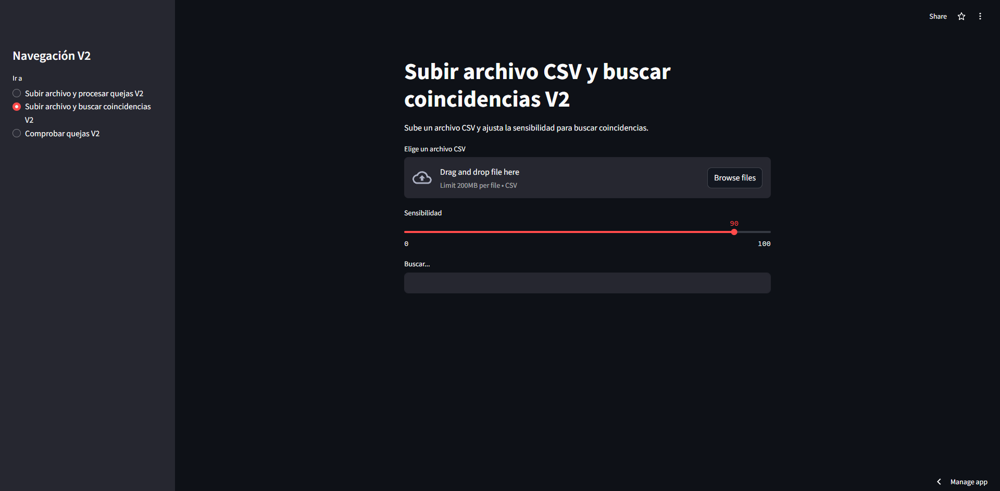
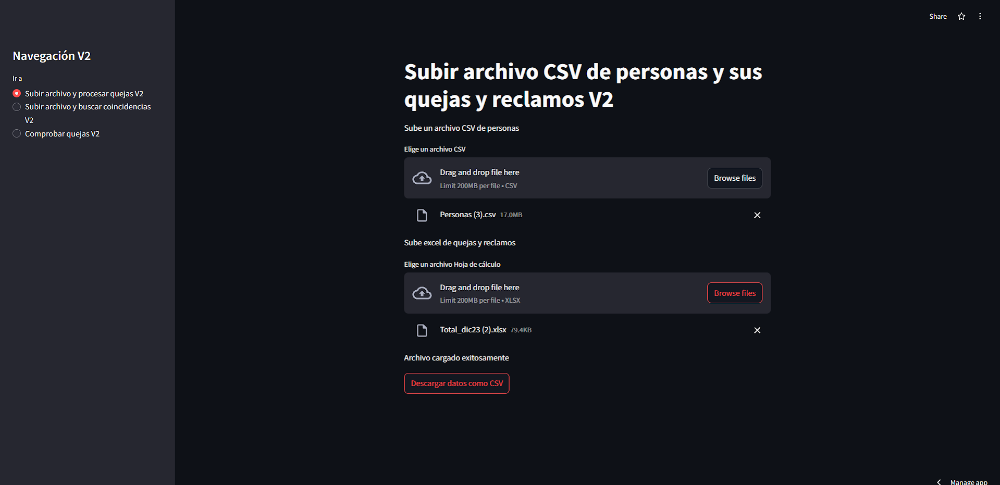
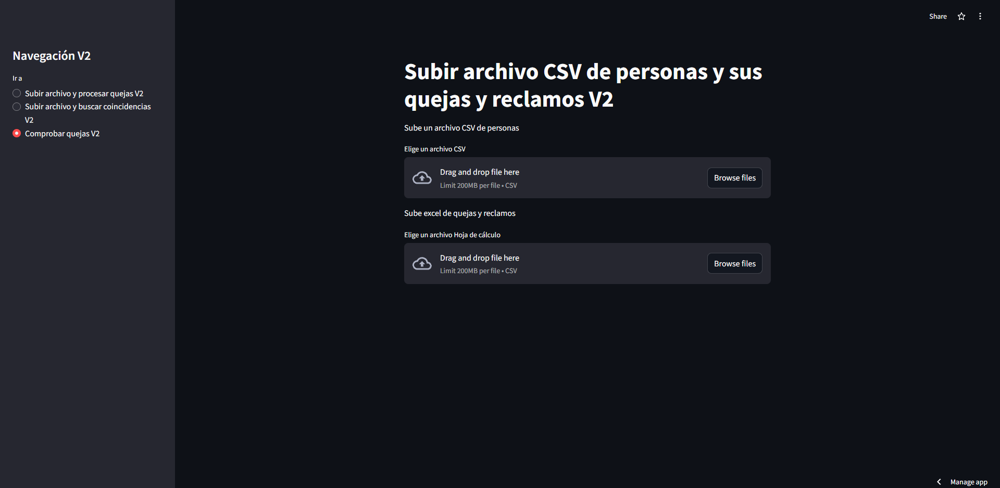

# SIMILARITY

# Sistema de Procesamiento y Búsqueda de Quejas

Este proyecto es una aplicación web desarrollada con Streamlit para el procesamiento y búsqueda de "quejas y reclamos". Permite subir archivos CSV y Excel, realizar transformaciones y búsquedas en los datos y descargar los resultados procesados.

## Descripción

El sistema tiene las siguientes funcionalidades:
- Subir archivos CSV de personas y buscar coincidencias con diferentes sensibilidades.
- Procesar quejas y reclamos subiendo un archivo CSV de personas y un archivo Excel de quejas.
- Comprobar quejas subiendo archivos CSV.

## Características

- **Transformación de Cadenas:** Normalización y transformación de cadenas para facilitar las búsquedas.
- **Cálculo de Puntuaciones:** Cálculo de puntuaciones basado en campos importantes de las personas(Validado por RENIEC, Grupo Familiar,Documento de Identidad,No Vacios).
- **Búsqueda de Coincidencias:** Búsqueda de coincidencias con diferentes algoritmos de similitud en las personas.
- **Procesamiento de Quejas:** Procesamiento y comparación de quejas con los datos proporcionados.
- **Descarga de Resultados:** Posibilidad de descargar los resultados procesados en formato CSV.


## Uso

### Subir archivo y buscar coincidencias

1. Selecciona "Subir archivo y buscar coincidencias V2" en la barra lateral.
2. Sube un archivo CSV.
3. Ajusta la sensibilidad para la búsqueda de coincidencias.
4. Ingresa el nombre a buscar y revisa los resultados.


### Subir archivo y procesar quejas

1. Selecciona "Subir archivo y procesar quejas V2" en la barra lateral.
2. Sube un archivo CSV de personas.
3. Sube un archivo Excel de quejas y reclamos.
4. Una vez cargado los dos archivos, se puede realizar la descarga del resultado cuando aparezaca el boton "Descargar como CSV".


### Comprobar quejas

1. Selecciona "Comprobar quejas V2" en la barra lateral.
2. Sube un archivo CSV de personas.
3. Sube un archivo CSV de quejas y reclamos descargados del sistema.
4. Una vez cargado los dos archivos, se puede realizar la descarga del resultado cuando aparezaca el boton "Descargar como CSV".


## Instalación

### Instalar y ejecutar el proyecto localmente sin container:

1. Clona el repositorio:
    ```bash
    git clone https://github.com/reSTE24/Similarity.git
    cd Similarity
    ```

2. Crea un entorno virtual e instala las dependencias:
    ```bash
    python -m venv env
    source env/bin/activate   # En Windows usa `env\Scripts\activate`
    pip install -r requirements.txt
    ```

3. Ejecuta la aplicación:
    ```bash
    streamlit run app.py
    ```

### Instalar y ejecutar el proyecto con container:

1. Clona el repositorio:
    ```bash
    git clone https://github.com/reSTE24/Similarity.git
    cd Similarity
    ```

2. Instalar Dev Container CLI:
    ```
    npm install -g @devcontainers/cli
    ```

3. Construir la imagen del contenedor:
    ```
    devcontainer build --name nombre_de_tu_imagen
    ```

4. Ejecutar el contenedor:
    ```
    docker run -p 8501:8501 nombre_de_tu_imagen
    ```

### Instalar y ejecutar el proyecto en el servidor de Streamlit:

Sigue estos pasos para instalar y ejecutar el proyecto localmente:

1. Dirigete a Create App
2. Selecciona Deploy from an app already in a GitHub repo.
3. LLena el formulario segun los detalles de tu repositorio.
4. Configura los accesos que necesites.

